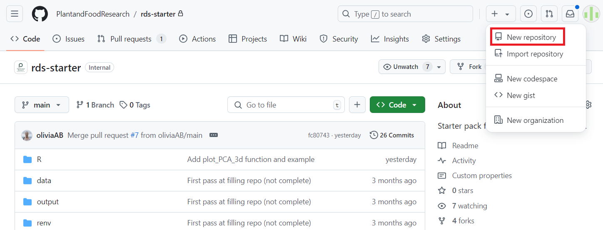
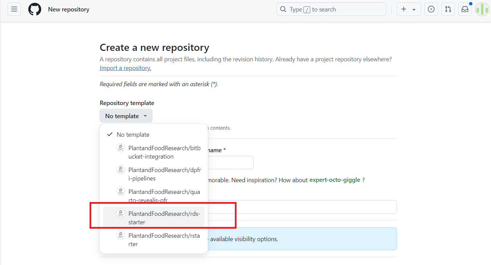
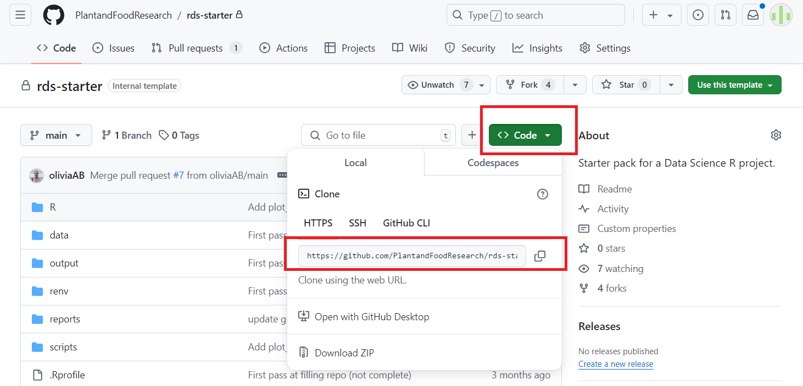
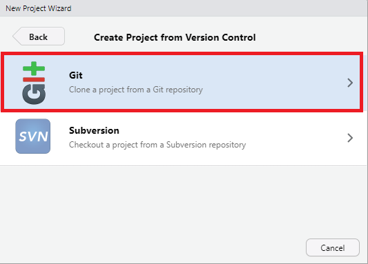
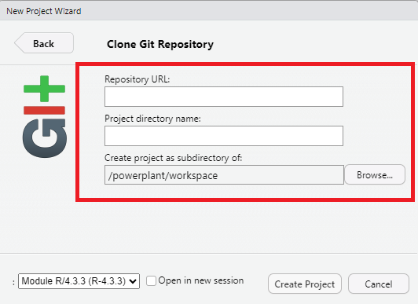
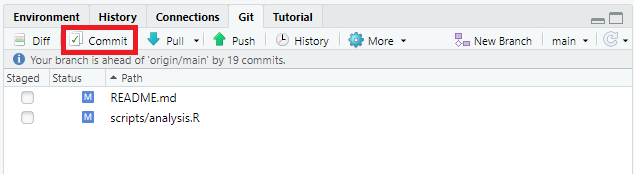
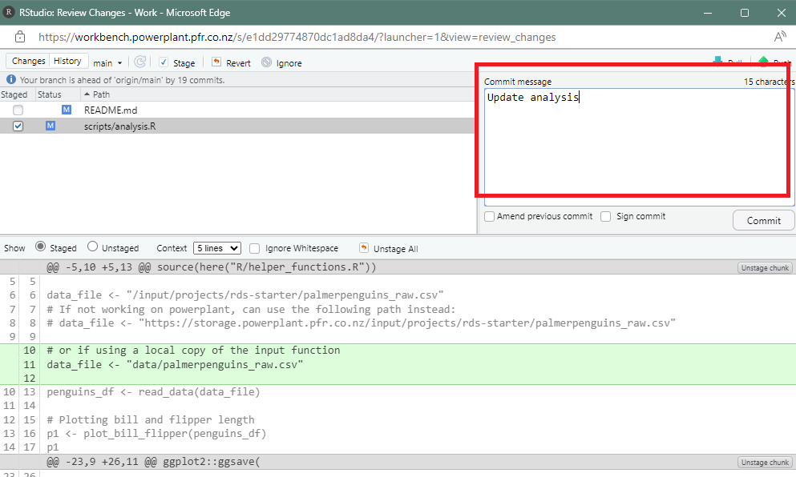
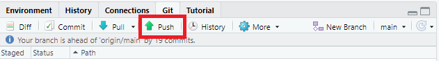

# rds-starter

This repository is meant to be used as a template for new data science or analysis projects in R. Using this template:

- facilitates the set-up phase for a new project;
- encourages the use of a consistent structure across data science projects;
- provides examples of R programming best practices, including how to use convenient R packages, and links to more information.

Please follow the checklists below to set up your project and start programming. Alternatively, you can read more about how to use the template in the 'Using this repository' section.

## Project checklists

### Set-up

- [ ] Create a new GitHub repository, selecting `rds-starter` as a template

- [ ] Clone the repository, e.g. using `usethis::clone_from_github("https://github.com/username/repo-name.git", destdir = "destination/path/for/local/repo/")`

- [ ] In this README file, populate the project information (starting line *XX*), replacing the instructions in italics.

- [ ] Delete the `rds-starter` instructions at the top of the README file (anything above line *XX*)

- [ ] Delete the `README.md` files from the `scripts/`, `R/`, `data/` and `reports/` folders

- [ ] If necessary, add the `output/` folder to the `.gitignore` file via `usethis::use_git_ignore("output/")` or by adding `output/` manually to the `.gitignore` file

- [ ] If necessary, add the `data/` folder to the `.gitignore` file via `usethis::use_git_ignore("data/")` or by adding `data/` manually to the `.gitignore` file

- [ ] Delete the `data/` folder if not using any local data file

- [ ] Install packages used in the example code via `renv::install()` (leave the brackets empty)

- [ ] Commit and push

### Working on the project

- [ ] Write helper functions in a script inside the `R/` folder

- [ ] Write your analysis script, calling on your helper functions, in a script inside the `scripts/` folder

- [ ] Save important output in the appropriate folder in powerplant, under `output/projects/`, or in the `output/` folder to be transferred to the appropriate Sharepoint site

- [ ] Record the packages used in your code via `renv::snapshot()`

- [ ] Commit and push

## Using this repository

When starting a new R project, you can create a GitHub repository and select `rds-starter` as a template. This will populate your new repository with the contents of this current repo. 

### R code

The `scripts/` folder is the place to save all of the `R` scripts containing your analysis code. The `analysis.R` file is present in this folder as an example. You can replace its content with your own. If it becomes long, consider splitting your code into several scripts (e.g. `01_data_cleaning.R`, `02_eda.R`, etc).

Any helper functions that you write should be saved in a `R` script inside the `R` folder. The `functions.R` file is present in this folder as an example. It showcases the use of common R packages for data import, cleaning, wrangling and visualisation. These functions can then be sourced in your analysis script, which is where they will be used. See the README file inside the folder for tips about writing functions and using these packages.

### Programming practices

We encourage you to follow the [tidyverse style guide](https://style.tidyverse.org/index.html), which provides rules about how to format your code. Following a style guide encourages consistency and makes code easier to both write and read.

If you are using RStudio, here is a list of helpful keyboard shortcuts (see the full list [here](https://docs.posit.co/ide/user/ide/reference/shortcuts.html)):

- Ctrl + Enter: run the current line or selection

- Ctrl + i: properly indent selected code

- Ctrl + Shift + M: insert a pipe operator (`|>` or `%>%`)

- Ctrl + Shift + c: comment or uncomment selected code

- Ctrl + Shift + /: properly indent selected comments (including roxygen2-style comments)

- Ctrl + Shift + i: insert a new code chunk in an Rmarkdown/quarto document

### Documentation

A key aspect of writing good code is to properly document it. This has several aspects:

- project documentation: each project folder should contain a README file, which contains key information about the project, e.g. the project aim, contributors, input data, etc. A pre-populated template is provided at the bottom of this README file, which you are encouraged to fill when setting up a new project. This ensures that future collaborators or colleagues have all the information they need to understand and reproduce your analysis.

- code documentation: your code should hopefully be written well enough that it is self-explanatory (refer to the [Managing Code](https://plantandfood.sharepoint.com/sites/int-DataManagement/SitePages/Managing-code.aspx) iPlant page for tips), but it is good practice to use comments to explain more complicated sections of code, or to split a script into logical segments.

- function documentation: we encourage the use of functional programming, i.e. writing helper functions that solve a specific problem (reading a dataset, generating a plot), which are then used in the main analysis scripts. Documenting these helper functions is an important part of facilitating the readability of your code.

### Input data

Input data should be stored in either a powerplant folder specific to your project, with `input/projects` (preferred), or in the `data/` folder. You can see an example for both options in the `scripts/analysis.R` file. As GitHub is not ideal for data or file storage/achive, if you work locally, you can ask GitHub to not track the files in the data folder, see **Using GitHub** below for more details. 

### Generated output

Any content generated, such as tables, figures, etc that are end products of your code (to be used in a report, for example) should be saved either in a powerplant folder specific to your project, within `output/projects`, or in the `output/` folder. You can see an example for both options in the `scripts/analysis.R` file. The second option (using the `output/` folder) is preferred only if your project team is not using powerplant. Depending on the number and size of files generated, the `output/` folder might have to be excluded from the GitHub repository, as GitHub is not appropriate for storing files. Instead, the files should be copied to the relevant Sharepoint site. 

### renv

This template uses the [`renv` package](https://rstudio.github.io/renv/) to keep a record of all packages used, as well as their version. This ensures that anyone cloning your repository in the future can easily install the packages you used, with the correct versions, in order to reproduce your analysis.

Using `renv` in your project is straightforward. After writing some code, which probably relies on some external packages, you can run the `renv::status()` command. This will let you know whether the existing packages record present in the project is up-to-date or not. Note that this is automatically run every time you open the project. If the record is not up-to-date, for example because you have added some code calling a new package, you can update it via `renv::snapshot()`. You can also use the `renv::install("pkgname")` function as a replacement for `install.packages("pkgname")`, but that is optional.

When first setting up your project from this template, you might see a message stating that your project is out-of-sync. This is because the packages used in the example code and recorded in the lockfile are not yet installed in your project library (where every package that you need for this project will be installed). You can install them by running `renv::install()`. Leaving the brackets empty will signal `renv` to install all packages recorded in the lockfile, with the latest version available.

### Using GitHub

**git** is the version control software, and **GitHub** is one of the most popular cloud-based systems for working with git. Using GitHub repo allows better version control of files and collaboration.  
For more information regarding using GitHub, refer to:  
[Happy Git and GitHub for the useR](https://happygitwithr.com/)  
[Version Control with Git and GitHub](https://biostats-r.github.io/biostats/github/)


Before using the repo, check if you have git installed, if not, download from https://git-scm.com/ .  
A GitHub account at https://github.com/.  
A GitHub token at [Personal Access Tokens](https://docs.github.com/en/authentication/keeping-your-account-and-data-secure/managing-your-personal-access-tokens).  Or in Rstudio, this process can be done with `usethis` package.  


```{r}
install.packages("usethis")
library(usethis)
use_git_config(
  user.name = "your_github_account_name", 
  user.email = "your_email_account")
  
  # if not create a Personal Access Token (PAT) yet, you need to do this once for every RStudio project.
  usethis::create_github_token()
  
  # this function will open GitHub and follow the instruction to make a PAT, then copy it by clicking on the clipboard icon and return to R.
  gitcreds::gitcreds_set()
  # this will ask you for your PAT: paste it at the prompt and press return. 
```

To use the rds-starter repo, we suggest this workflow:  

1. Create a new GitHub repo yourself, this will generate your repo on GitHub *remote*: 
  

&nbsp;&nbsp;&nbsp; use rds-starter as the template:  
  

2. Clone the repo you have created to *local* using Rstudio.  
&nbsp; - Get the GitHub Repository URL: https://github.com/PlantandFoodResearch/rds-starter.git
   

&nbsp;&nbsp;&nbsp; - Launch RStudio.  

&nbsp;&nbsp;&nbsp; - In the top menu bar, click File → New Project.  

  

&nbsp;&nbsp;&nbsp; - In the New Project dialog box, select Version Control.  

&nbsp;&nbsp;&nbsp; - In the next window, select Git.  

  

&nbsp;&nbsp;&nbsp; - Paste the GitHub repo URL into the "Repository URL" field.  
  

&nbsp;&nbsp;&nbsp; - Choose a directory where you want to store the local version of the repo.  

&nbsp;&nbsp;&nbsp; - Click Create Project.  


RStudio will now:  

Clone the repository from GitHub to the location on your local machine.  
Open the project within RStudio as a new project.  

3. Develop your code.  

4. Commits the code to your *local* repo.  
  
  

5. Push the changes to the *remote* repo.  
  

6. Check the *remote* repo and all changes are tracked on GitHub.  


## Contribution guidelines

If you want to make changes to this repository or suggest improvements, there are two main ways to contribute:

- open an issue [here](https://github.com/PlantandFoodResearch/rds-starter/issues)

- [fork the repository](https://docs.github.com/en/pull-requests/collaborating-with-pull-requests/working-with-forks/fork-a-repo), make some changes, and [open a pull request](https://docs.github.com/en/pull-requests/collaborating-with-pull-requests/proposing-changes-to-your-work-with-pull-requests/creating-a-pull-request-from-a-fork).

---

**Delete everything above this line.**

# Project title

*Project description: context, overall aim, some key information about the experiment and the analyses intended/performed.*

## Key contributors

*List of key contributors and their roles, as bullet points.*

## Input data

*Information about the input data (where it is stored), who provided it, what it contains.*

## Analysis

*What analyses were performed, and which files were generated as a result (e.g. cleaned version of the data).*

## Repository content

*A list of the key folders and files.*

- `scripts/` folder: collection of `R` scripts containing analysis code

- `R/` folder: collection of `R` scripts containing helper functions used for the analysis

- `reports/` folder: collection of RMarkdown/Quarto documents used to generate the reports

## How to reproduce the analysis

In the R console, in the project top directory, run the following commands: 

```{r}
# Installing necessary packages
renv::restore()

# other commands to run, e.g. to execute a script etc
```
